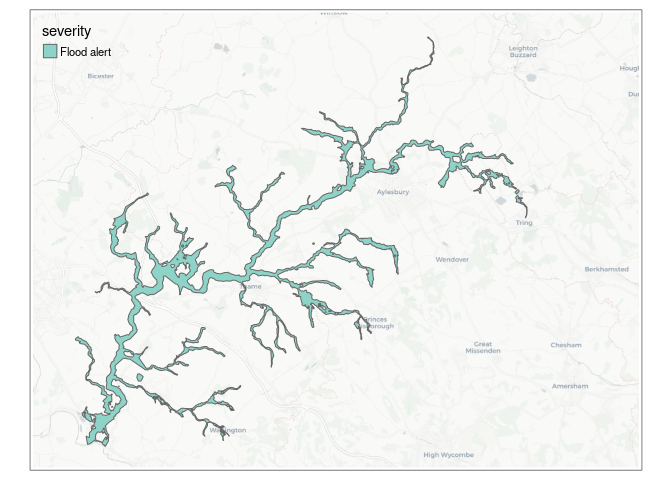

<!-- README.md is generated from README.Rmd. Please edit that file -->

# eaflood

<!-- badges: start -->

[](https://github.com/DavidASmith/eaflood/actions)
<!-- badges: end -->

The `eaflood` package provides access to data from the [Environment
Agency FloodMonitoring
API](https://environment.data.gov.uk/flood-monitoring/doc/reference)
covering flood areas in England.

The following data are available:

-   Flood warnings
-   Flood areas
-   Monitoring stations
-   Measures (*e.g.* level and flow recorded at the monitoring stations)
-   Readings values for each measure over the previous 4 weeks.

## Installation

You can install the development version of eaflood from
[GitHub](https://github.com/) with:

``` r
# install.packages("devtools")
devtools::install_github("DavidASmith/eaflood")
```

## Examples

Here a few examples of what you can do with `eaflood`:

``` r
library(eaflood)
```

Get current flood warnings:

``` r
plot_flood_warnings(interactive = FALSE)
```

 Get
flood areas for a given location…

``` r
plot_flood_areas(lat = 53.38,
                 lon = -1.46,
                 dist = 10, 
                 interactive = FALSE)
```

 Get
details of available monitoring stations…

``` r
plot_stations(town = "Gloucester", interactive = FALSE)
```

 Get recent
readings for a particular measure…

``` r
plot_measure_readings("L0607-level-stage-i-15_min-m", show_max = FALSE)
```


See the vignette for more information.
